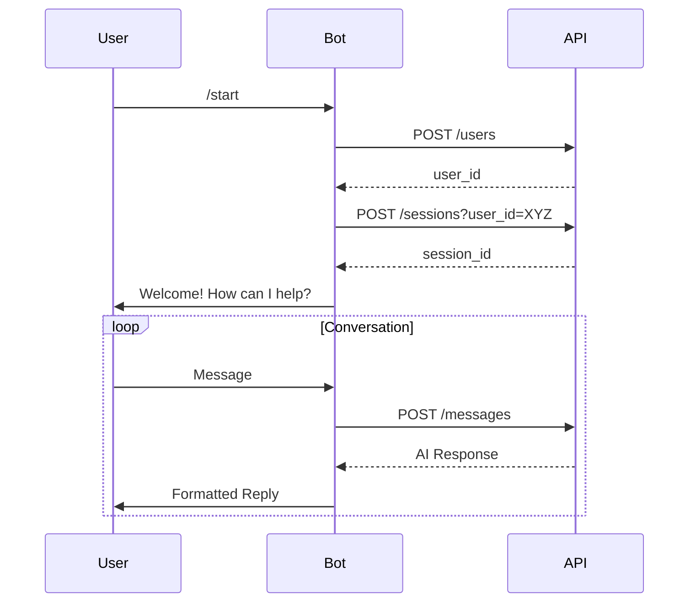

# TheryAI Documentation

**Version**: 0.1.0  
**Platform Compatibility**: GitHub | Postman | API Clients  

---

## Table of Contents
1. [Overview](#overview)
2. [API Reference](#api-reference)
   - [Base URL & Authentication](#base-url--authentication)
   - [Core Endpoints](#core-endpoints)
3. [Telegram Bot Guide](#telegram-bot-guide)
   - [Getting Started](#getting-started-with-the-bot)
   - [Interaction Flow](#interaction-flow)
4. [Data Models](#data-models)
5. [Error Reference](#error-reference)
6. [Postman Integration](#postman-integration-guide)

---

## Overview
TheryAI is a dual-component system designed for mental health support:
- **REST API**: Manages user sessions and conversation processing
- **Telegram Bot**: Provides real-time empathetic interaction

---

## API Reference

### Base URL & Authentication
```http
https://testys-thery-ai.hf.space/
```

- **Authentication**: None (stateless design)
- **Rate Limits**: 100 requests/minute/IP

---

### Core Endpoints

#### 1. User Creation  
```http
POST /users
```
| Field          | Description                              |
|----------------|------------------------------------------|
| Response       | `{"user_id": "uuid"}`                    |
| Error Codes    | 500 (Server Error)                       |


**Example Request**:
```bash
curl -X POST https://testys-thery-ai.hf.space/api/v1/users
```

---

#### 2. Session Management  

```http
POST /sessions
```
| Parameter      | Description                              | Required |
|----------------|------------------------------------------|----------|
| user_id        | From `/users` response                   | Yes      |

**Success Response**:
```json
{
  "session_id": "session_uuid",
  "user_id": "user_uuid",
  "is_new_session": true
}
```

---

#### 3. Conversation Handling  
```http
POST /sessions/{session_id}/messages
```
| Parameter      | Location   | Example Value         |
|----------------|------------|-----------------------|
| session_id     | Path       | abc123-456def         | 
| message        | Query      | "Feeling overwhelmed" |

**Response Structure**:
```json
{
  "response": "Let's explore what's causing this stress...",
  "emotional_analysis": {
    "primary_emotion": "Anxiety",
    "confidence": 0.92
  },
  "suggested_actions": ["Deep breathing", "Journaling"]
}
```

---

## Telegram Bot Guide

### Getting Started with the Bot
1. Search for [`@TheryAI_Bot`](https://t.me/Thery_AIBot) on Telegram
2. Initiate with `/start` command
3. Interactive menu appears:
   ```
   [💬 New Conversation]  
   [📜 History]  
   [⚙ Settings]
   ```

### Key Features
- **Real-Time Analysis**: Emotional state detection in every response
- **Session Persistence**: 30-day conversation history
- **Crisis Protocol**: Auto-suggests hotlines for urgent needs

### Interaction Flow


---

## Data Models

### Session Object
```json
{
  "session_id": "string",
  "user_id": "string",
  "created_at": "ISO8601",
  "last_active": "ISO8601"
}
```

### Emotional Analysis Model
```json
{
  "primary_emotion": "string",
  "intensity": 1-10,
  "confidence": 0.0-1.0,
  "triggers": ["string"],
  "coping_strategies": ["string"]
}
```

---

## Error Reference

| HTTP Code | Error Type               | Resolution Steps                |
|-----------|--------------------------|----------------------------------|
| 500       | Internal Server Error    | Retry after 30 seconds           |
| 422       | Invalid Parameters       | Verify request format            |
| 404       | Session Not Found        | Create new session via /sessions |

---

## Postman Integration Guide

1. **Import Collection**  
   `File → Import → Link` → Paste OpenAPI JSON URL

2. **Configure Environment**  
   ```ini
   BASE_URL = https://testys-thery-ai.hf.space/
   DEFAULT_USER = {{user_id}}
   ACTIVE_SESSION = {{session_id}}
   ```

3. **Test Workflow**  
   Run collection in this order:
   ```text
   1. Create User
   2. Create Session
   3. Send Test Message
   4. Retrieve History
   ```

[](https://www.postman.com/theryai/workspace)

---

**📘 Documentation License**: CC BY-NC 4.0 | **🔄 Last Updated**: 2024-04-14 
**📧 Support**: testimonyadekoya.02@gmai.com | **🐛 Bug Reports**: GitHub Issues
