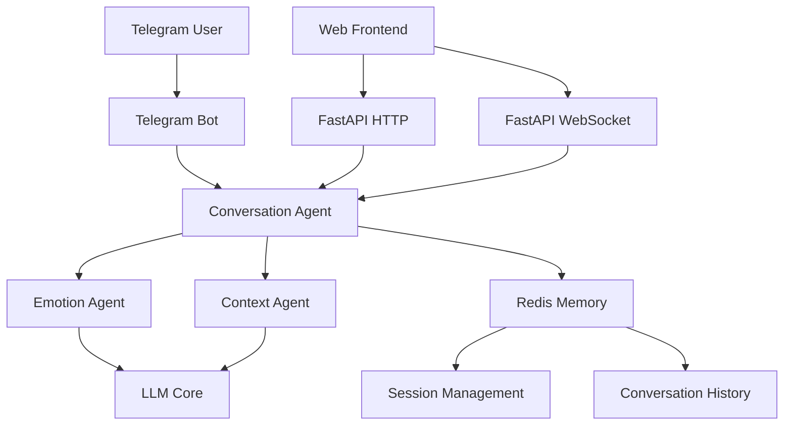

```mermaid
    graph TD
    A[Telegram User] --> B[Telegram Bot]
    C[Web Frontend] --> D[FastAPI HTTP]
    C --> E[FastAPI WebSocket]
    B & D & E --> F[Conversation Agent]
    F --> G[Emotion Agent]
    F --> H[Context Agent]
    G & H --> I[LLM Core]
    F --> J[Redis Memory]
    J --> K[Session Management]
    J --> L[Conversation History]
```